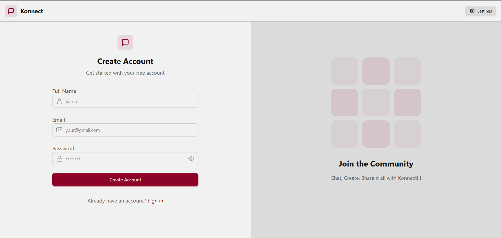

A real-time chat application built using the MERN stack (MongoDB, Express.js, React, Node.js) with Socket.IO for instant messaging.

🔗 [Live Demo](https://new-chat-app-1-12qr.onrender.com/) 

Features:

- User Authentication & Authorization with JWT
- Real-time messaging using Socket.IO
- One-on-One chat
- Online Users Filter
- Global state management with Zustand
- 20+ Theme modes
- Fully responsive UI

Tech Stack:

**Frontend:** React, TailwindCSS, DaisyUI, Axios  
**Backend:** Node.js, Express.js, MongoDB  
**Real-time:** Socket.IO  
**Authentication:** JWT  
**Deployment:** Render 

Made with ❤️ by Anirudha Chaudhary